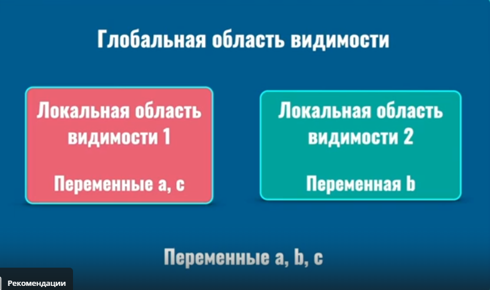
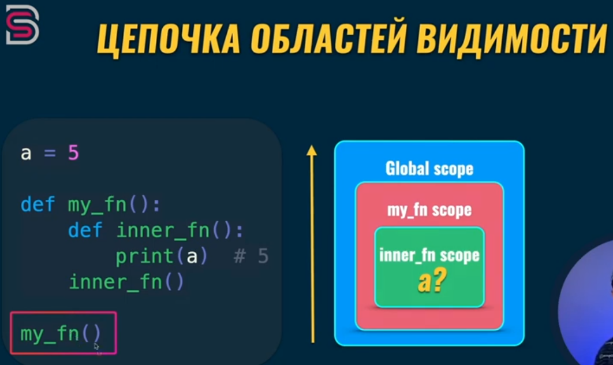

- print имеет атрибуты flush (flush=True - немедленный вывод) и file (file=f - запись в конкретный файл внутри менеджера)

- Файлы должны оканчиваться пустой строкой (исторически в Unix в конце файла был '\n' для обозначения конца файла)

- Библиотека black позволяет форматировать файл по PEP8 (pip install black; black file_name.py). Возможности откатить изменения нет.
Можно форматировать `ctrl + alt + L` в файле

- Python - объектно-ориентированный ЯП. Главное в языке - объект. Все сущности в Python являются объектами (экземпляр того или иного класса).


#### Объект
- Объект - это экземпляр того или иного класса
У каждого объекта есть атрибуты
- Атрибут объекта называется методом, если его значение - функция

#### Класс
Класс - это шаблон или прототип для создания объектов
На основании класса можно создать много объектов (экземпляров), независимых друг от друга

#### Основные типы
- Строка (str): 'Bogdan'
- Целое число (int): 10
- Логический (bool): True/False
- Список (list): [1, 2, 3] - позволяет хранить элементы разных типов
- Словарь (dict): {'min': 5, 'max': 8} - в словарях хранятся элементы по типу 'ключ': значение

#### Выражение (expression)
Выражение - комбинация значений, переменных и операторов, которая вычисляется и возвращает результат. 
Результатом выражения является значение. В выражении обычно несколько операторов (+, or, in и т.д.)
Результат выражения можно использовать в вызове функциии, либо для присвоения результата другой переменной
Проверить выражение: есть в круглых скобках print() прописать значение и будет выведен результат - это выражение, а если
будет ошибка - инструкция. 

Примеры выражений:
- Математические операции: `x + 3`
- Конкатенация: `'hello ' + 'world'`
- Вызов функции: `math.sqrt(x)`
- Сравнение значений: `x > 5`
- Простые значения: `5`, `'строка'`

#### Инструкция (statements - заявления, инструкция)
Инструкция - это команда, выполняемая интерпретатором Python. При выполнении инструкции происходит определённое действие,
но нет конкретного возвращаемого значения.
Инструкция выполняет действие (создаёт функцию, запускает цикл, возвращает результат функции, импортирует другой модуль).

Примеры инструкций:
- Присваивание значения переменной: `x = 5`
- Условные операторы: `if`, `elif`, `else` (условная инструкция)
- Циклы: `for`, `while`
- Импорт модулей: `import math`
- Функция `print` для вывода данных

#### Основные отличия инструкций от выражений
- Инструкция выполняет действие (например, присваивание)
- Выражение вычисляется и возвращает значение
- Инструкции могут содержать выражения
- Выражения могут использоваться в инструкциях
`x = 5` # инструкция присваивания
`y = x + 3` # инструкция с выражением
`result = y * 2` # инструкция с выражением
`print(result)` # инструкция вывода

+ Вызов функции может быть как выражением, так и инструкцией.
Выражение:
`result = math.sqrt(4)`, `x = print('Hello')`, `value = len([1, 2, 3])`
Инструкция:
`print('Hello')`, `open('file.txt', 'w')`, `math.sqrt(4)`

+ return - это ИНСТРУКЦИЯ, а не выражение. Он выполняет действие - завершает выполнение функции и возвращает значение.

#### Встроенные функции
- print()
- input()
- dir() - отображение имён всех атрибутов объекта
print(dir(__builtins__)) - вывод всех атрибутов для объекта builtins (вывод встроенных в python функций)


#### Переменные
Переменная - ссылка на объект в памяти
Пока есть переменная, объект есть в памяти. Если той же переменной был присвоен другой объект, то прежний объект 
будет удалён из памяти по прошествии времени.

Переменная - это именованная область памяти для хранения данных, состоящая из 3 основных компонентов:
1) Имя переменной;
2) Значение (хранящиеся данные);
3) Адрес в памяти;
Переменные дают возможность повторного доступа к значениям
Тип любой переменной определяется типом присвоенного значения

`age` - публичная переменная, доступная из любой части кода, стандартное соглашение для открытых атрибутов класса 
(рекомендуется в большинстве случаев)

`_age` - защищённая переменная, предназначенная для внутреннего использования, технически доступна извне, но считается "непубличной"
(используется для защиты от конфликтов имён при наследовании, указании на то, что переменная является частью внутренней реализации)

`__age` - приватная переменная (mangling). Python автоматически изменяет имя переменной для предотвращения конфликтов.
Доступ к переменной возможен только внутри класса.
Механизм name mangling: Python добавляет к имени префикс с именем класса - `__age` становится `_ClassName__age`

Пример использования
```python
class Person:
    def __init__(self, age):
        self.age = age  # Публичная
        self._age = age  # Защищённая
        self.__age = age  # Приватная

# Доступ к переменным
person = Person(25)
print(person.age)  # Допустимо
print(person._age)  # Технически допустимо, но не рекомендуется
# print(person.__age)  # Вызовет ошибку AttributeError
print(person._Person__age)  # Доступ к приватной переменной через изменённое имя
```

Именование переменных
1) snake_case : переменные, функции, методы, модули
2) PascalCase : классы
3) kebab-case : пакеты (my-package)
4) UPPER_CASE : константы (DB_PASSWORD)

**Правила работы с переменными**
1) Всегда выбирать осмысленные названия;
2) Использовать имя существительное (name, comments, new_photos);
3) Имя переменной должно отвечать на вопрос: "Что содержит?"
+ Название функций и методов необходимо начинать с глагола (get_data, create_request, merge_names) для указания действия
Имя функции должно отвечать на вопрос: "Что выполняет/возвращает/изменяет?"

Идентификатор - ссылка на место в памяти, где сохраняется объект. И каждая переменная содержит эту ссылку. Переменные не  
содержат значения, они содержат ссылку на объект в памяти.

`id(variable)` - получение адреса объекта в памяти

При каждом новом запуске кода будет разный id, потому что при новом запуске кода объект создаётся заново, то есть нельзя
использовать объекты, которые мы создавали ранее (при предыдущих запусках кода)

```python
my_name = 'Igor'

print(id(my_name))
```


#### Разное
- Комментарии игнорируются интерпретатором Python
- enumerate() - встроенная функция Python, добавляющая счётчик к итерируемому объекту и возвращающая его в виде объекта-итератора.
Она особенно полезна, когда нужно получить доступ как к индексу, так и к значению элементов в цикле.
`enumerate(iterable, start=0)`
enumerate оптимизирована для работы с большими данными и обычно эффективнее ручного подсчёта индексов, так как:
1) Не создаёт дополнительных копий данных;
2) Работает с итераторами напрямую;
3) Минимизирует накладные расходы.

- pwd (print working directory) - утилита командной строки, которая отображает полный путь к текущей рабочей директории.

- casefold() - метод строк для приведения значения в нижний регистр (агрессивная версия lower). Обрабатывает больше частных случаев (немецкая буква В и т.д.)
- center(width[, filler]) - метод строк для центрирования текста (width - длина результирующей строки, filler - заполнитель)
```
name = "мир"
print(name.center(20, '-')) # --------мир---------
```

- string.punctuation - предопределённая констата в модуле string, содержащая все знаки препинания в виде строки.
'!"#$%&\'()*+,-./:;<=>?@[\\]^_`{|}~'

- encode() - метод строк, преобразующий строку в последовательность байтов с использованием указанной кодировки.
Это необходимо для работы с данными, которые нужно сохранить или передать в определённом формате.
`строка.encode(encoding='UTF-8', errors='strict') # errors - способ обработки ошибок при кодировании`
```python
print('мир'.encode()) # b'\xd0\xbc\xd0\xb8\xd1\x80'
```

- translate() - метод строк, использующийся для замены или удаления определённых символов в строке на основе таблицы перевода
`строка.translate(таблица)`
Таблица - обязательный параметр, содержащий правила перевода символов. Создать таблицу можно 2 способами:
1) С помощью str.maketrans() (формирует словарь с ключами и значениями для перестановки) {'a': '4', 'e': '3'} и т.д.
2) Через прямое создание словаря с ASCII-кодами

```python
"""Замена гласных на цифры"""
text = 'tutorial'
table = str.maketrans('aeiou', '43109') # maketrans создаёт таблицу перевода символов (translation table)
result = text.translate(table)
print(result) # t9t0r14l
```

```python
"""Удаление гласных"""
text = 'example'
vowels = 'aeiou'
table = str.maketrans('', '', vowels) # maketrans создаёт таблицу перевода символов (translation table)
result = text.translate(table)
print(result) # xmpl
```

```python
"""Использование ASCII-кодов"""
text = 'test'
table = {116: 84, 101: 69} # t -> T, e -> E
result = text.translate(table)
print(result) # TEST
```

```python
"""Удаление знаков препинания"""
import string

text = 'Hello, world! How are you?'
table = str.maketrans('', '', string.punctuation)
# string.punctuation - предопределённая констата в модуле string, содержащая все знаки препинания в виде строки.
clean_text = text.translate(table)
print(clean_text)
```

- Пример работы с datetime
```python
import datetime as d

print(
    d.MAXYEAR,  # 9999
    d.MINYEAR,  # 1
    d.__all__, # ('date', 'datetime', 'time', 'timedelta', 'timezone', 'tzinfo', 'MINYEAR', 'MAXYEAR', 'UTC')
    d.date.today(), # 2025-10-05
    sep='\n'
)
```

- магические методы не вызываются напрямую, они вызываются как следствие использования операторов в Python

- **Конъюгировать** - процесс соединения или сопряжения чего-либо. 
- **Конъюнкция** (логическое умножение) - логическая операция, возвращающая истину только тогда, когда все входящие в неё
высказывания истинны (И, ^, &, X)
- **Дизъюнкция** (логическое сложение) - логическая операция, возвращающая истину, если хотя бы одно из входящих в неё 
высказываний истино (ИЛИ, V, +)

- hex - Hexadecimal (шестнадцатеричная система счисления). Это способ записи чисел, где используется 16 символов:
0-9 и A-F (A=10, B=11, ..., F=15), потому что 16 = 2^4 удобно для представления двоичных данных (каждый hex-символ = 4 бита)
Используется для:
1) Адресов в памяти, байтов или точных float/int
2) Цвета (в CSS/HTML) вроде #RRGGBB - это тоже hex, но для RGB-компонента (каждые два hex-символа = 0-255). Это подмножество hex для графики.
3) Хэши (MD5), UUID, машинный код.
Простыми словами, hex - как "сжатый двоичный код". Вместо длинного binary (101010100) пишем короче: 0xAA.

- Python не выполняет неявную конвертацию типов значений: 
`'10 + 10 = TypeError: can only concatenate str (not 'int') to str)`
`5 + '10' = TypeError: unsupported operand type(s) for +: 'int' and 'str'`
`5 + 4.5 = 9.5`
`5 + 4.5 = 9.5`
`True + 7 = 8`

Порядок операторов имеет значение
Пример конвертация операторов через магические методы (обяснения неявной конвертации)
```python
test = 5
float_num = 4.5

print(int_num + float_num)  # 9.5
print(int_num.__add__(float_num))  # NotImplemented
print(float_num.__radd__(int_num))  # 9.5 
```

Порядок бъявления операндов имеет значения при конвертации, так как, например, в классе `int` есть метод `__add__`, 
а в классе `float` есть метод `__radd__`, и они работают по разному.


#### PEP8
- Для отступов использовать пробелы вместо Tab
- Длина строк не более 79 символов
- Функции и классы должны быть отделены от других строк кода двумя пустыми строками (в большинстве ЯП одна строка)
- Импорты модулей должны быть на отдельных строках
- Комментарии в конце строки кода должны отделяться по крайней мере двумя пробелами `print(10)  # Two spaces in comment`
- Можно использовать больше 2 пробелов (для выравнивания всех комментариев в одну линию)

Форматирование кода по PEP8 в PyCharm `ctrl + alt + L` 

#### Функции
Созданы для многократного вызова блока кода
- Параметр - переменная, доступная внутри функции
- Аргумент - значение для параметра

Вызов функции можно передать как аргумент при вызове другой функции
```python
def sum_nums(a, b):
    sum = a + b
    return sum

# Результат вызова функции передаётся в этой же функции
print(
    sum_nums(sum_nums(50.5, 20), sum_nums(10, 5)),  # 85.5
)
```
- return - инструкция (statement), инструкция выполняет определённые действия
- вызов функции - выражение
- Если в функции нет return, она возвращает None
- Функция print возвращает None всегда (-> None)
```python
print(
    print('Bogdan')
)
# Bogdan
# None
```

Результат вызова функции можно присвоить переменной
```python
first_sum = sum_nums(10, 5)
print(first_sum)
```


#### Статическая и динамическая типизация
Тип переменной определяется во время выполнения программы
ЯП деляется на языки со статической и динамической типизацией
Python - динамически типизируемый язык
```python
String a = 'abc' # статическая типизация
a = 'abc' # динамическая типизация
```

Пример динамической типизации в Python
```python
def print_name(name):
    print(name)

print_name('Bogdan')

print_name = 15

print_name('Bogdan')  # TypeError: 'int' object is not callable
```

#### Типы и структуры данных
1) В Python отсутствуют примитивные типы. В Python все сущности - объекты, и когда мы создаём переменную с типом int, то
в памяти компьютера создаётся объект типа 'int', и этот объект является экземпляром класса int. Если значение 10, то
создаётся один объект в памяти, если создали другое число (15) и присвоили его другой или той же переменной, то
создаётся новый объект в памяти, который также является экземпляром класса 'int', но он не зависит от объекта с числом 10

Примитивные типы данных - это базовые типы данных в программировании, которые представляют собой простейшие значения без
внутренней структуры. Обычно примитивные типы: хранятся в стеке, являются неизменяемыми, занимают меньше памяти, работают 
быстрее сложных типов. В Python все типы являются объектами и нет строгого разделения на примитивные и непримитивные типы.
Даже базовые типы имеют методы и свойства. Условно "примитивными" (базовыми) можно назвать типы int, float, bool, str.
Отсутствие примитивных типов связано с ООП-подходом, динамической типизацией, единым механизмом работы со всеми типами данных.

Примитивные типы данных (primitive data types) - это фундаментальные, встроенные в ЯП типы, представляющие собой простейшие
единицы информации. ОНИ НЕ ЯВЛЯЮТСЯ ОБЪЕКТАМИ ИЛИ СТРУКТУРАМИ, а хранятся напрямую в памяти (обычно в стеке), что делает их
эффективными по скорости и памяти. В отличие от составных (или ссылочных) типов, таких как классы, массивы или строки, 
примитивные типы не имеют методов и не требуют создания экземпляров. Примитивные типы варьируются от ЯП, но в среднем они
включают в себя: int, byte, short, long, float, double, char, bool, void

Примитивные типы - основа любого кода: они используются для расчётов, условий и циклов. Их понимание помогает оптимизировать
производительность и избежать ошибок, таких как переполнение (overflow) для чисел.

2) В Python существуют изменяемые и неизменяемые объекты. Например, объект с типом int является неизменяемым: его нельзя 
изменить, возможно создать новый объект с другим значением. Другой пример - список, его можно изменять (добавлять/удалять элементы),
при этом сам объект остаётся в памяти, и мы изменяем этот объект.
Изменяемые объекты - mutable objects (мутабельные), мутировать - изменить объект без создания нового объекта
Неизменяемые объекты - immutable object (немутабельные)

**Неизменяемые объекты**
1) Строки (str)
2) Логический (bool)
3) Целые числа (int)
4) Вещественные (float)
5) Кортежи (tuple)
6) Ничто (None)

**Изменяемые объекты**
1) Список (list)
2) Словарь (dict)
3) Множества (set)
4) user-defined class (пользовательские классы) - экземпляры классов, созданные разработчиком

**Дополнительно по теме**
1) Python может кэшировать immutable объекты для экономии памяти: 
- Маленькие целые числа (`int` от -5 до 256) интернируются (хранятся в едином пуле)
- Строки тоже могут интернироваться (особенно коротки или литералы)

2) В python переменные - это ссылки на объекты в памяти. Присваивание не копирует данные, а создаёт новую ссылку

Пример создания нового объекта для неизменямых типов:
```python
"""Для int"""
a = 5  # Создаётся immutable объект int со значением 5
b = a  # b ссылается на тот же объект
print(id(a), id(b))  # id(a) == id(b)

a = a + 1  # Создаётся НОВЫЙ объект 6, a теперь ссылается на него
print(a, b)  # 6 5 (b остался на старом объекте)
print(id(a), id(b))  # id(a) != id(b)
```

```python
"""Для str"""
s1 = 'Hello'
s2 = s1
print(s1, s2) # Hello Hello
print(id(s1), id(s2))  # id(a) == id(b)

s1 += ' world'  # Создаётся новый str 'hello world'; s1 перессылается
print(s1, s2)  # Hello world Hello
print(id(s1), id(s2))  # id(a) != id(b)
```

Пример создания новых значений для изменяемых типов
```python
"""Обычное изменение"""
lst1 = [1, 2, 3]  # Создаётся mutable объект list
lst2 = lst1  # lst2 ссылается на тот же объект
lst1.append(4)  # Изменение объекта "на месте"

print(lst1, lst2)  # [1, 2, 3, 4] [1, 2, 3, 4] (оба изменились)
print(id(lst1), id(lst2))  # id(lst1) == id(lst2)
```

```python
"""Создание поверхностной копии"""
import copy
lst1 = [1, 2, 3, 4]  # Создаётся mutable объект list
lst2 = copy.copy(lst1)  # Поверхностная копия
lst1.append(5)

print(lst1, lst2)  # [1, 2, 3, 4, 5] [1, 2, 3, 4]
print(id(lst1), id(lst2))  # id(lst1) != id(lst2)
```

- Интернировать - Термин интернировать (или интернирование, от англ. interning) — это специальный механизм оптимизации памяти 
в языках программирования (в первую очередь в Python, но также в Java, Lisp и других). Он означает создание и 
хранение единственного экземпляра (копии) объекта для одинаковых значений, чтобы избежать дублирования в памяти.
Вместо создания новых объектов для каждого одинакового значения, программа использует ссылку на существующий "канонический"
(стандартный) объект из специального пула (intern pool или cache).

#### CPython
CPython - это эталонная и наболее распространённая реализация (интерпретатор, а не версия!) ЯП Python. Фактически это официальный интерпретатор байт-
кода Python, который написан на языке C. Особенность в том, что CPython не компилирует Python-код в C, а преобразует его
в байт-код, который затем интерпретируется виртуальной машиной. Существуют и другие реализации (PyPy, Jython), но CPython - 
основная.

CPython - это программа, которая читает и выполняет кода на Python. Она написана на C (быстром и низкоуровневом), и это
самая популярная версия Python.

При скачивании Python с официального сайта мы получаем именно CPython. Это наиболее популярная версия языка.
Проверить, что мы используем CPython
```python
import platform
print(platform.python_implementation()) # CPython
```


#### Строки
Строка - последовательность символов. Каждая строка - экземпляр класса str (встроенный класс).
Рекомендация использовать одинарные кавычки для одного слова, двойные - для многословных строк.
Есть другая рекомендация: выбрать один стиль оформления кавычек и придерживаться его для написания кода.

`type(встроенный класс)` всегда возвращает <class 'type'>
```python
print(type(str)) # <class 'type'>
print(type(bool)) # <class 'type'>
```

#### Вещественные числа (float)
Вещественные числа в Python - это числа с плавающей точкой, экземпляры класса float.
Большинство методов вещественных чисел - это специальные (dunder-методы, как `__add__`), которые используются автоматически
при операциях (например, сложение), но есть и публичные методы, которые можно указать явно.

Float в Python - это двойная точность (64 бита), так что методы учитывают это (возможны неточности из-за двоичного представления,
как 0.1 + 0.2 != 0.3)

**Основные публичные методы и свойства для float**
`fl = 24.4`

- as_integer_ratio() - возвращает дробь в виде кортежа (числитель, знаминатель). Возвращает представление float как 
несократимой дроби в виде кортежа `(числитель, знаминатель)`. Это полезно, чтобы понять точное значение числа без ошибок
плавающей точки (float хранится в двоичном виде, так что 0.1 не точно 1/10). Используется для точных вычислений с дробями,
отладки или когда нужно избежать неточностей float.

`print(fl.as_integer_ratio())  #  (122, 5), т.к. 24.4 = 122/5`
`print(0.1.as_integer_ratio())  #  (3602879701896397, 36028797018963968) точное представление 0.1 в двоичном виде`

- conjugate() - возвращает комплексно-сопряжённое число (для float это само число, так как оно реальное).
Используется в основном для комплексных чисел, для float практически бесполезен
`print(fl.conjugate())  # 24.4`

- fromhex(string) - классовый метод: создаёт float из шестнадцатеричной строки (hex-формата), которая представляет число
в формате IEEE 754 (стандарт для float). Строка должна начинаться с '0x' или быть чисто hex-цифрами.
Используется для чтения/записи точных float-значений в hex-формате (полезно на низкоуровневом программировании, сериализации
данных или отладке бинарных файлов).
`print(fl.fromhex('0x33'))  # ~5.1e-323`

- hex() - возвращает hex-представление числа. Показывает точное битовое хранение числа в 64 битах (мантисса + экспонента),
без потерь десятичного вывода. Hex - компактный способ писать большие двоичные числа (каждый hex-символ = 4 бита).
`print(fl.hex())  # 0x1.8cccccCCCCDP+4`

- is_integer() - проверяет, является ли число целым (например, 24.0 - True, 24.1 - False). Используется для проверки
возможности преобразования в int, или в валидации данных (например, 'это пиксели?')
`print(fl.is_integer)  # False`

**Особенности работы с float (0.1 + 0.2 != 0.3, а равно 0.300000000000004)**
Это связано с тем, что компьютеры хранят числа в двоичной системе (как 0 и 1), а не в десятичной, как мы привыкли (0.1 = 1/10)
Многие десятичные дроби (включая 0.1 и 0.2) не могут быть точно представлены в двоичном виде - они становятся "приближением".
В результате сложения таких "приближенных" значений результат получается "грязным" (не идеально 0.3)

Проблемы на практике:
1) Сравнение. `if x == 0.3` может не сработать. Нужно использовать `math.isclose(x, 0.3)` (проверяет, близко ли)
2) Накопление ошибок. В циклах или больших расчётах (финансы, физика), ошибка растёт. Суммируя 0.1 слишком много раз, 
получить не 1.0, а 0.99999999
3) Округление: `round(0.1 + 0.2, 1)` = 3 (помогает), но не всегда
4) Где критично: Деньги (0.1 + 0.2 = ?), графика (пиксели), наука (симуляции). В играх или веб - часто терпимо.

Как решить:
1) Использовать math.isclose()
```python
import math

a = 0.1
b = 0.2

print(
    math.isclose(a+b, 0.3) # True
)
```

2) Использовать модуль decimal (точные десятичные), (идельно подходит для денег)
```python
from decimal import Decimal as D

a = D('0.1')
b = D('0.2')

print(a + b)  # 0.3 - точно!
print(a + b == D('0.3'))  # True
```

#### Комплексные числа (complex)
Используются для различных математических вычислений, а также при обработке данных.
Комплексное число состоит из действительной и мнимой частей. Комплексное число - экземпляр класса complex в Python.

```python
complex_a = 3 + 5j  # 3 - действительная часть, 5 - мнимая + j
complex_b = 4 + 7j

summ = complex_a + complex_b
diff = complex_a - complex_b
mul = complex_a * complex_b
div = complex_a / complex_b

print(
    summ,  # 7+12j (суммируются части по отдельности)
    diff,  # -1-2j 
    mul,  # (-23+41j) = (3 + 5j) * (4 + 7j) = 3*4 + 3*7j + 5j*4 + 5j*7j. 
    #  ВАЖНО! Последнее число 5j*7j (35j) в итоговой формуле будет со знаком минус, и из первого числа вычитаем это число
    # 12 - 35j (последнее число) + 21j + 20j = -12j+41j
    div,  # (0.7230769230769232-0.015384615384615427j)
    type(result)  # <class 'complex'>
)
```

#### Публичные методы целых чисел (int) и bool
Класс `int` реализует несколько полезных публичных методов, связанных с битовой манипуляцией, преобразованиями и рациональными
представлениями (наследуемыми от `numbers.Rational` и `numbers.Complex`)

1) `bit_length(self) -> int`. Возвращает количество бит, необходимых для представления абсолютного значения числа в двоичной системе.
```python
print(
    (10).bit_length(),  # 4 (бинарно: 1010)
    (-10).bit_length(),  # 4
    (100).bit_length(),  # 7
)
```

2) `to_bytes(self, length: int, byteorder: str, *, signed: bool = False) -> bytes`. Преобразует целое число в последовательность
байтов заданной блинны. `byteorder` (способ записи байтов в памяти компьютера) может быть `little` или `big`
`byteorder` определяет, как многобайтовые числа хранятся в памяти и передаются между системами. 
- Big-endian (прямой порядок байтов) - старший байт числа записывается первым. Этот порядок используется в TCP/IP, в файловых
системах и других стандартах
- Little-endian (обратный порядок байтов) - младший байт числа записывается первым. Такой порядок используется в процессорах x86
и некоторых других архитектурах.
```python
print(
    (1024).to_bytes(2, 'big'),  # b'\x04\x00'
    (1024).to_bytes(2, 'little'),  # b'\x04\x04'
)
```

3) `from_bytes(bytes_object: bytes. byteorder: str, *, signed: bool = False) -> int`. Класс-метод создаёт целое число из
последовательности байтов.
```python
print(
    int.from_bytes(b'\x04\x00', 'big'),  # 1024
    int.from_bytes(b'\x04\x00', 'little'),  # 4
)
```

4) `as_integer_ratio(self) -> tuple[int, int]`. Возвращает кортеж (numberator, denominator), представляющий число как 
рациональную дробь (числитель, знаминатель). Для int denominator всегда 1
```python
print(
    (5).as_integer_ratio(),  # (5, 1)
    (10.5).as_integer_ratio(),  # (21, 2)
)
```

5) `conjugate(self) -> int`. Возвращает комплексное сопряжение (для целых чисел - само число, т.к. мнимая часть 0).
Наследовано от `numbers.Complex`
```python
print(
    (3).conjugate(),  # 3
    (4 + 7j).conjugate(),  # (4-7j)
)
```
Комплексное сопряжение - это математическая операция над комплексным числом, при которой знак мнимой части меняется на
противоположный, а действительная часть остаётся неизменной.
(a + bi), где
- a - действительная часть;
- b - мнимая часть;
- i - мнимая единица (i**2 = -1)

Сопряжённое число к a + bi будет иметь вид a - bi

6) `denominator(self) -> int`
Знаменатель рационального представления (всегда 1 для `int`)
`print((7).denominator)  # 1`

7) `numerator(self) -> int`
Числитель рационального представления (само число для `int`)
`print((9).numerator)  # 9`

8) `imag(self) -> int`
Мнимая часть комплексного числа (всегда 0 для `int`)
`print((4).imag)  # 0`
`print((4 + 7j).imag)  # 7.0`

9) `real(self) -> int`
Вещественная часть комплексного числа (само число для `int`)
`print((2).real)  # 2`
`print((4 + 4j).real)  # 4.0`

#### Магические методы
Магические методы - это методы, определённые на уровне того или иного класса. Эти методы наследуются всеми экземплярами классов. 
Магические методы - внутренние методы классов и они обычно не вызываются явно.
У каждого класса свой набор магических методов.
Например, в классе `int` есть метод `__add__`, а в классе `float` есть метод `__radd__`, и они работают по разному. 
Вот почему порядок объявления операндов имеет значения при конвертации.

Магические - потому что явно не вызываются при использовании тех или иных операторов.

Работа магических методы на примере приведения типов
```python
int_num = 10
float_num = 25.7
str_val = 'abc'

print(
    int_num.__mul__(float_num),  # NotImplemented
    int_num * float_num,  # 257.0
    float_num.__rmul__(int_num),  # 257.0
    int_num * str_val,  # abcabcabcabcabcabcabcabcabcabc
    int_num.__mul__(str_val),  # NotImplemented
    str_val.__rmul__(int_num),  # abcabcabcabcabcabcabcabcabcabc
)
```

bool является и классом, и функцией, поскольку с его помощью можно создавать новые экземпляры класса 
bool - это функция-конструктор

Документация по магическим методам
```python
my_list = []
print(my_list.__eq__.__doc__)
print(help(my_list.__eq__))
```


#### Список
Список - упорядоченная последовательность элементов (порядок следования элементов в списке играет роль).
У каждого элемента в списке есть свой уникальный индекс.

Удаление элемента списка
```python
users_inputs = [1, 2 ,3]
del users_inputs[0]
print(users_inputs)  # [2, 3]
```

Список словарей
```python
users = [
    {
        'user_id': 134,
        'user_name': 'Alice'
    },
    {
        'user_id': 831,
        'user_name': 'Bob'
    },
]

print(len(users))  # 2
print(users[0]['user_id'])  # 134
```

Отображение переменных в списке
```python
my_fruit = 'apple'
other_fruit = 'banana'
new_fruit = 'lime'

all_fruits = [my_fruit, other_fruit, new_fruit]

print(all_fruits)  # ['apple', 'banana', 'lime']

my_fruit = 'add'
print(my_fruit)  # add

print(all_fruits)  # ['apple', 'banana', 'lime'] !!!!!! my_fruit не меняется в списке !!!!!!
```
В примере список не меняется, потому что в Python при создании списка происходит копирование значений, а не ссылок на переменные.
Поэтому изменение переменной никак не влияет на значение в списке, потому что список хранит собственную копию исходной
строки 'apple'.

Аналогия: представим, что вы делаем фотографию (список) трёх фруктов. Позже мы меняем один фрукт на другой, но фотография
остаётся прежней, так как она уже содержит зафиксированное изображение.

Если нужно изменить значение в списке, то это делается напрямую:
`all_fruits[0] = 'add'`

Можно использовать подход с динамическим изменением значений
```python
fruits = ['apple', 'banana', 'lime']
my_fruit = fruits[0]  # Получаем ссылку на первый элемент списка
my_fruit = 'add'  # Это создаст новую переменную, не меняя список

# Правильный способ:
fruits[0] = 'add'  # Теперь список изменится
```

Методы списков объекты наследуют от класса List
- append()
- extend()
`list.extend(iterable)`. Используется для добавления элементов из одного списка в конец другого списка
```python
list1 = [1, 2, 3]
list1.extend([4, 5, 6])  # [1, 2, 3, 4, 5, 6]
```

Ещё extend добавляет посимвольно, в то время как append - целиком
```python
my_nums = [10, 50, 0, 5, 5, 100]
my_nums.append('123')  # [10, 50, 0, 5, 5, 100, '123'] 
my_nums.extend('123')  # [10, 50, 0, 5, 5, 100, '1', '2', '3']
```
 
- insert(). Вставка элемента в указанное место (по индексу). 
ВАЖНО! insert() вставляет новый элемент на указанный индекс, не заменяет значение.
```python
my_nums = [10, 50, 0, 5, 5, 100]
my_nums.insert(2, -5)
print(my_nums)  # [10, 50, -5, 0, 5, 5, 100]
```
- pop()
- remove()
- copy()
- reverse()
- sort()
- index()
- count()
- clear()

Копирование списков
```python
lst = [i for i in range(1, 10)]
lst2 = lst[:]  # Создание нового списка (новый объект)
#  lst2 = lst.copy()  # Аналогично, создание нового списка (новый объект)
#  lst2 = list(lst)  # Создание нового списка, используя встроенную функцию list
lst3 = lst  # Копирование по ссылке
lst2.append('213')

print(
    lst,
    lst2,
    lst == lst2,
    lst is lst2,
    sep='\n'
)
```

Вставить один элемент (список) в произвольное место в другом списке
```python
lst = [True, 1, 2.0, 'abc', {'a': 2}]
lst1 = [{1, 2}, 4+7j]

insert_pos = 3  # Индекс, куда вставляем (после первых 2 элементов)
lst[insert_pos:insert_pos] = lst1  # Заменяем пустой срез на lst1

#  lst[1:3] = lst1  # Заменяем пустой срез на lst1 

print(lst)
```

3 способа перевернуть список
```python
lst = [True, 1, 2.0, 'abc', {'a': 2}]

lst1 = lst[::-1]
lst2 = list(reversed(lst))
lst.reverse()

print(
    lst,
    lst1,
    lst2,
    sep='\n'
)
```


#### Словари (dict)
Словари - объекты, создающиеся на основании встроенного в Python класса dict
Словарь - набор элементов по типу ключ:значение
В словаре не может быть двух ключей с одинаковым названием
Порядок элементов в словаре не имеет значения (у них нет индексов)

**Добавление/Удаление пары ключ:значние в существующий словарь**
```python
my_motorbike = {
    'brand': 'Ducati',
    'price': 25000,
    'engine_vol': 1.2
}

# Добавление
my_motorbike['is_new'] = True # {'brand': 'Ducati', 'exte': 'Ducati', 'price': 25000, 'engine_vol': 1.2, 'is_new': True}

# Удаление
del my_motorbike['engine_vol']

# Доступ к значению с помощью переменной
key_name = 'brand'
my_motorbike[key_name] = 'BMW'
```

Найти ключ по значению в словаре
```python
my_motorbike = {
    'brand': 'Ducati',
    'price': 25000,
    'engine_vol': 1.2
}

```

```python
"""Основное решение - инвертируемый список"""
from collections import defaultdict  
# defaultdict не вызывает keyerror, а автоматически создаёт и возвращает значение по умолчанию

reverse_dict = {value: key for key, value in my_motorbike.items()}
print(reverse_dict)  # {'NewDuc': 'brand', 25000: 'price', 1.2: 'engine_vol'}

key = reverse_dict.get('NewDuc')
print(key)  # brand

# Если значения могут дублироваться (список ключей)
my_motorbike = {
    'brand': 'NewDuc',
    'model': 'NewDuc',
    'price': 25000,
    'engine_vol': 1.2
}

reverse_dict_multi = defaultdict(list)  # Default: пустой list() для новых ключей
for key, value in my_motorbike.items():
    reverse_dict_multi[value].append(key)

keys = reverse_dict_multi['NewDuc']
print(keys)  # ['brand'] или ['brand', 'model'] (если есть дубли)
```

```python
"""Вариант-1"""
key = next(filter(lambda kv: kv[1] == 'NewDuc', my_motorbike.items()), None)[0] if any(kv[1] == 'NewDuc' for kv in my_motorbike.items()) else None
```

```python
"""Вариант-2"""
#  pip insall bidict
from bidict import bidict
bi_dict = bidict(my_motorbike)
key = bi_dict.inverse['NewDuc']  # brand
```

**defaultdict - приимер подсчёта элементов в списке**
```python
from collections import defaultdict

words = ['apple', 'banana', 'apple', 'cherry']
count = defaultdict(int)  # Default: 0

for word in words:
    count[word] += 1  # Авто-создаёт 0, если нет, затем +1

print(count)  # defaultdict(<class 'int'>, {'apple': 2, 'banana': 1, 'cherry': 1})
```

**Работа со вложенностью в словаре**
```python
my_motorbike = {
    'brand': 'Ducati',
    'engine_vol': 1.2,
    'price_info': {
        'price': 25000,
        'is_available': True,
        'test': {
            'asd': 2,
        }
    },
}

print(
    my_motorbike.keys(),
    my_motorbike.values(),
    my_motorbike.items(),
    my_motorbike['price_info']['price'],  # 25000
    my_motorbike['price_info']['test']['asd'],  # 2
    sep='\n'
)
```

**Использование переменных для создания значений в словарях**
```python
brand = 'Ducatti'
bike_price = 25000
engine_volume = 1.2

my_motorbike = {
    'brand': brand,
    'price': bike_price,
    'engine_vol': engine_volume,
}

print(my_motorbike)
```

**Методы словарей**
- get(key, default) - возвращает значение по ключу. Если ключа нет, возвращает None или default
`print(my_motorbike.get('brand'))`
Если вызвать `my_motorbike['brand']`, и такого ключа не будет - вызовется ошибка, в отличие от get.

- setdefault(key, default=None) - возвращает значение по ключу (если ключа нет, добавляего с default и возвращает default)
Отличие от get в том, что setdefault добавялет ключ с default, если его нет (мутирует словарь), а .get не добавляет.
get - только чтение, setdefault - чтение + автодобавление

- items() - возвращает объекта класса dict_items([(key, value)]) с ключами и значениями элемента в кортеже

- keys() - возвращает список ключей

- values() - возвращает список значений

- pop(key[, default]) - удаляет ключ и возвращает его значение. Если ключа нет, возвращает default или KeyError

- popitem() - удаляет из словаря последнюю пару "ключ:значение".
Не рекомендуется к использованию, т.к. словарь - неупорядоченная последовательность элементов, а popitem() удаляет последний
добавленный ключ, но мы не всегда знаем, какой ключ был добавлен последним, поэтому прогнозировать трудно. Лучше удалять через del.

- clear() - очищает словарь, удаляя из него все ключи.

- copy() - копирование словаря (новый объект). Необходимо использовать, когда нужны операции со словарём, не изменяя
оригинальный объект.


Пример добавления нового значения
```python
my_dict = {
    'brand': 'Ducati',
    'price': 390_000_00,
    'vol': 1.2,
}

print(
    my_dict.setdefault('test', 'asd'),  # asd
    my_dict,  # {'brand': 'Ducati', 'price': 39000000, 'vol': 1.2, 'test': 'asd'} (добавляет 'test': 'asd')
    sep='\n'
)
```

- fromkeys(iterable[, value=None]) - создаёт новый словарь из итерируемого списка ключей, все с одним значением.
Например, подходит для быстрой инициализации (счётчики или дефолты для множества ключей). Статический метод, не меняет
оригинал.
`dict.fromkeys(keys, value)`

```python
keys = ['color', 'size', 'year']
new_dict = dict.fromkeys(keys, 'unknown')
print(new_dict)
```

- update([other=()], /, **kwargs) - обновляет dict парами из другого iterable (dict, list of tuples) или kwargs.
Новые ключи добавляются в конец, новые - перезаписываются. Либо меняет значение существующего ключа, а если его нет, добавляет
новую запись
```python
my_dict = {
    'brand': 'Ducati',
    'price': 390_000_00,
    'vol': 1.2,
}

my_dict.update({'price': 28000, 'color': 'red'})
my_dict.update(model='V4')

print(my_dict)  # {'brand': 'Ducati', 'price': 28000, 'vol': 1.2, 'color': 'red', 'model': 'V4'}
```

- del d[key]


**Создание словаря из других типов данных**
```python
my_list = [['first', 1], ['second', True]]
#  my_list = [('first', 1), ('second', True)]  # Аналогично сработает с кортежами
#  my_list = [['first', 1], ('second', True)]  # Аналогично сработает со списком + кортежем

print(
  dict(my_list)  # {'first': 1, 'second': True}
)
```

**Задача: добавить в словарь введённые пользователем пары ключ:значение**
```python
(key_1, value_1, key_2,
 value_2, key_3, value_3) = (input('Введите первый ключ: '),
                             input('Введите первое значение: '),
                             input('Введите второй ключ: '),
                             input('Введите второе значение: '),
                             input('Введите третий ключ: '),
                             input('Введите третие значение: '),)

my_dict = {
    key_1: value_1,
    key_2: value_2,
    key_3: value_3,
}

print(my_dict)
```

#### Кортеж
Кортеж - упорядоченная последовательность элементов. Кортеж изменять нельзя. Порядок следования важен. Нельзя использовать del.
```python
my_fruits = ('apple', 'banana', 'lime')
other_fruits = ('banana', 'apple', 'lime')

print(my_fruits == other_fruits)  # False
```

Пример словарей в кортежах
```python
# my_fruits = ('apple', 'banana', 'lime')
# other_fruits = ('banana', 'apple', 'lime')
#
# print(my_fruits[0])

users = (
    {
        'user_id': 134,
        'user_name': 'Alice'
    },
    {
        'user_id': 831,
        'user_name': 'Bob'
    }
)

print(users[1]['user_id'])  # 831

users[1]['user_id'] = 100  # Изменяем словарь

print(users[1]['user_id'])  # 100
```

**Методы кортежей**
- count() - подсчёт количества определённых элементов в кортеже
- index(value, start) - поиск индекса определённого элемента

**Добавление элемента в кортеж с преобразованием в список**
```python
my_tuple = (1, 2, 3, 3, 2, 2)

my_list = list(my_tuple)
my_list.append(7)
my_tuple = tuple(my_list)

print(my_tuple)
```

Посимвольная запись строки в кортеже
```python
my_tuple = tuple('abdc')

print(my_tuple)  # ('a', 'b', 'c', 'd')
```

Преобразования словаря в кортеж (запишутся только ключи)
```python
my_tuple = tuple({'first': 1, 'second': True})

print(my_tuple)
```

#### Множества (набор)
Множества - неупорядоченная последовательность уникальных элементов (нет индексов). Обычно в наборах однотипные данные.

Порядок в наборах не важен
```python
my_fruits = {'apple', 'banana', 'lime'}
other_fruits = {'banana', 'apple', 'lime'}
#  Это одинаковые наборы
```

Индексов в множествах нет. Нельзя использовать del.

В множества нельзя добавлять изменяемые объекты (списки, словари, множества), потому что для каждого элемента формируется 
hash, а при изменении hash тоже будет меняться:
```python
lists_set = {[1, 2], [20, 5]}
# TypeError: unhashable type: 'list'
```

Хэш-значение - это уникальное числовое представлние объекта, которое генерируется на основании его содержимого. 
Это цифровой отпечаток объекта по типу: 2910710401598742315.

В множества можно добавлять кортежи
```python
my_set = {(10, 10), 5, 15, 15}
```

**Методы множеств**
- add()
```python
photo_sizes = {'1920x1080', '800x600'}
photo_sizes.add('1024x768')

print(photo_sizes)  # {'1024x768', '1920x1080', '800x600'}
```

- union() - объединение наборов (уникальные элементы в обоих множествах, включая их пересечение) [ (///)///(///) ] 
Можно использовать `|` вместо union. При вызове оригинальные наборы не изменяются.
```python
photo_sizes = {'1920x1080', '800x600'}
other_sizes = {'1024x768', '800x600'}

all_sizes = photo_sizes.union(other_sizes)
#  all_sizes = photo_sizes | other_sizes

print(all_sizes)  # {'800x600', '1024x768', '1920x1080'}
```

- intersection() - пересечение двух множеств, общие элементы в двух наборах [ ()///() ]
Можно использовать `&`. При вызове оригинальные наборы не изменяются.
```python
photo_sizes = {'1920x1080', '800x600'}
other_sizes = {'1024x768', '800x600'}

common_sizes = photo_sizes.intersection(other_sizes)
#  common_sizes = photo_sizes & other_sizes

print(common)  # {'800x600'}
```

- issubset() - проверяет, включен ли один набор в другой. Возвращает True или False.
Является ли множество "A" подмножеством (входит в состав другого множества) "B"
```python
nums = {10, 5, 35}
other_nums = {20, 5, 12, 10, 35}

res = nums.issubset(other_nums)

print(res)  # True
```

- issuperset() - проверяет, является ли элемент супермножеством другого набора
```python
nums = {10, 5, 35}
other_nums = {20, 5, 12, 10, 35}

res = other_nums.issuperset(nums)

print(res)  # True
```

- difference() - показывает разницу между множествами (есть в только в одном).
Можно использовать `-`
```python
"""Есть только в my_set, и нет в other_set"""
my_set = {'abc', 'd', 'f', 'y'}
other_set = {'a', 'f', 'd'}

#  print(my_set - other_set)  # {'y', 'abc'}
print(my_set.difference(other_set))  # {'y', 'abc'}
```

```python
"""Есть только в other_set, и нет в my_set"""
my_set = {'abc', 'd', 'f', 'y'}
other_set = {'a', 'f', 'd'}

#  print(other_set - my_set)  # {'a'}
print(other_set.difference(my_set))  # {'a'}
```

- discard() - удаление элемента из множеств. Не вызывает ошибку при передаче несуществующего элемента (в отличии от remove)
```python
my_set = {'abc', 'd', 'f', 'y'}

my_set.discard('d')

print(my_set)
```

- remove() - удаление элемента из множества. Вызывает ошибку при передаче несуществующего элемента (в отличии от discard)
```python
my_set = {'abc', 'd', 'f', 'y'}

my_set.remove('ded')  # KeyError: 'ded'

print(my_set)
```

- copy() - копирование набора (разные объекты в памяти).
```python
my_set = {'abc', 'd', 'f', 'y'}
other_set = {'a', 'f', 'd'}

copied_set = my_set.copy()

my_set.add('t')  # {'d', 't', 'y', 'f', 'abc'}
copied_set.add('l')  # {'d', 'l', 'y', 'f', 'abc'}

print(my_set)
print(copied_set)
print(copied_set == my_set)  # False
print(id(copied_set) == id(my_set))  # False
```

- symmetric_difference() - ЕСТЬ в одном из наборов, НЕТ в другом и НЕТ в пересечении.
```python
my_set = {'abc', 'd', 'f', 'y'}

copied_set = my_set.copy()

my_set.add('t')  # {'d', 't', 'y', 'f', 'abc'}
copied_set.add('l')  # {'d', 'l', 'y', 'f', 'abc'}

print(my_set.symmetric_difference(copied_set))  # {'l', 't'}
```
 
Другой пример (формула работы symmetric_difference наглядно)
```python
a = {'abc', 'd', 'f', 'y'}
b = {'abc', 'd', 'f', 'l'}
print((a | b) - (a & b))  # {'y', 'l'}
```

- pop() - удаляет и возвращает последний элемент
```python
my_set = {'abc', 'd', 'f', 'y'}

a = my_set.pop()

print(my_set, a)
#  {'d', 'f', 'abc'} 
#  y
```

- clear() - очистка набора
```python
my_set = {'abc', 'd', 'f', 'y'}

my_set.clear()

print(my_set)  # set()
```

- update() - добавление элемента в набор
```python
my_set = {'abc', 'd', 'f', 'y'}

my_set.update('J')

print(my_set)  # {'f', 'y', 'abc', 'J', 'd'}
```

#### Диапазон
Диапазон - упорядоченная неизменяемая последовательность элементов. Обычно используются в циклах.
```
my_range = range(7, 20, 3)

print(type(my_range))  # <class 'range'>

print(my_range.start)  # 7
print(my_range.stop)  # 20
print(my_range.step)  # 3

print(my_range.index(7))  # 0
print(my_range.count(8))  # 1
```

#### Колбэк-функции
Колбэк-функции - это функции, которые передаются как АРГУМЕНТЫ в другую функцию и там вызываются.

Пример-1:
```python
def other_fn():
    pass
    
def fn_with_callback(callback_fn):
    callback_fn()
    
fn_with_callback(other_fn)
```

Пример-2:
```python
def print_number_info(num):
    if (num % 2) == 0:
        print('Number is even')
    else:
        print('Number is odd')


def print_square_num(num):
    print("Square of the num is", num * num)


def process_num(num, callback_fn):
    callback_fn(num)


enter_number = int(input('Enter your number: '))

process_num(enter_number, print_number_info)
process_num(enter_number, print_square_num)
```

Пример-3 (имитация отправки данных на удалённый сервер)
```python
def send_data(data):
    """Sending data to the remote server"""
    pass

def process_data(input_data, send_data_fn):
    updated_data = input_data.copy()
    # actions with updated_data
    send_data_fn(updated_data)

process_data({'name': 'Bogdan'}, send_data)
```

**Правила работы с функциями**
1) Называть функции исходя из выполняемых задач
2) Название функции нужно начинать с глагола
3) Одна функция должна выполнять одну задачу
4) Не рекомендуется изменять внешние относительно функции переменные

#### Область видимости
Область видимости определяет границы действия (доступность) переменной


Пример локальной и глобальной областей видимости
```
a = 10

def my_fn():
    a = True
    b = 15
    print(a)  # True
    print(b)  # 15
    
my_fn()

print(a)  # 10
print(b)  # NameError: name 'b' is not defined
```

Цепочка областей видимости
```
a = 5

def my_fn():
    def inner_fn():
        print(a)  # 5
    inner_fn()
    
my_fn()
```


**Нелокальная область видимости**
```
a = 40
def some():
    a = 20
    def test():
        print(a)
    test()

print(
    some()  # 20!
)
```

**nonlocal**
Ключевое слово `nonlocal` используется в Python для работы с переменными из замыкающего (enclosing) scope в вложенных
функциях. Оно не позволяет не только читать, но и изменять переменные, определённые в внешней функции, без создания
локальной копии. Без `nonlocal` вложенная функция не сможет модифицировать переменную из enclosing scope - вместо этого
она создаст новую локальную переменную с тем же именем.

Пример (изменение переменной enclosing scope)
```
def outer():
    x = 10  # Переменная в enclosing scope
    def inner():
        nonlocal x  # Указываем, что x из outer
        x += 5  # Изменяем x
        print(f'Внутри inner: x = {x}')  # x изменилось
    inner()
    print(f'В outer после inner: x = {x}")  # x изменилось
    
outer()
# Вывод:
# Внутри inner: x = 15
# В outer после inner: x = 15
```

**global**
Ключевое слово используется для работы с переменными из global scope внутри функции. Оно позволяет не только читать, но и
изменять глобальные переменные, определённые на уровне модуля (вне функций), без создания локальной копии.

Не рекомендуется изменять внешние относительно функции переменные.

Пример-1 (определение глобальной переменной внутри функции)
```
def func():
    global z  # z не определена глобально
    z = 100  # Создаст глобальную z
    
func()
print(z)  # Вывод: 100 (теперь z глобальная)
```

Пример-2 (изменение глобальной переменной внутри функции)
```
x = 10

def func():
    global x
    x += 5
    print(f'Внутри func: x = {x}')
    
func()
print(f'Глобальная x после func: {x}')

# Вывод:
# Внутри func: x = 15
# Глобальная x после func: 15
```

Пример-3
```
def my_fn():
    global a  # Здесь переменная a ещё не создана! Создание только на следующей строчке
    a = 10
    
my_fn()
print(a)  # 10
```

**Вывод доступных переменных в области видимости с помощью `dir()`**
```
c = 5

def my_fn(a, b):
    """Вывод доступных переменных в контексте (области видимости)"""
    #  global d  # в таком случае dir() не выведет d
    d = 10
    print(c)
    print(a, b)
    print(dir())  # ['a', 'b', 'd']

my_fn(3, 5)
```

С помощью `print(dir())` можно отсматривать список всех доступных в области видимости переменных из места вызова `print(dir())`

#### Операторы
1) Арифметические (+ - * /)
2) Сравнения (== != > <)
3) Логические (not and or), `not` всегда возвращает значение типа bool, а `and` или `or` возвращает значение одного из операндов
4) Присвоения ( = )
5) Текстовые (is, is not, in, not in)

Магические методы операторов
```
Сравнение == (.__eq__)
```

Функция `dir()` выводит список имён атрибутов определённого объекта

**Унарные операторы**
Унарные операторы всегда имеют один операнд
```
- my_number  # префиксный унарный оператор
+ my_number
not is_activated  # отрицание
```

**Бинарные операторы**
У бинарных операторов два операнда
```
a = 5
a + b
a += 5 
a == b
a and b
```

**Инфиксная запись**
Инфиксная запись - это когда оператор находится между операндами
```
a = True
a + b
a += 5
a or b
a > b
```

**Опреаторы in, not in**

Проверка присутствия элемента в последовательности (название ключа)
```
my_car = {
    'brand': 'Toyota',
    'price': 10_000,
}

print('brand' in my_car)  # True

print('year' in my_car)  # False

print('year' not in my_car)  # True

```

#### Ложные значения
```
int 0
float 0.0
complex 0j

dict {}
list []
tuple ()
set set()
range range(0)
str ""

bool False
NoneType None
```

Проверить falsy-значение можно с помощью `bool(value)` или `not not`

Пример `not not`
```
print(not not {})  # False
```

Пример совместно `bool(value)` и `not not`
```
print(
    bool(0),  # False
    not not 0,  # False
)
```


**not and or**
- Оператор not часто используется в условных конструкциях `if else`
`and` и `or` являются операторами короткого замыкания (short-circuit)

- Оператор and
`Выражение 1 and Выражение 2`
Если "Выражение 1" ложно:
- Выражение 2 игнорируется
- Возвращается результат "Выражения 1"

Если "Выражение 1" правдиво:
- Вернётся "Выражение 2" независимо от того, правдиво оно, или ложно 

- Оператор or
`Выражение 1 and Выражение 2`
Если хотя бы 1 из выражений правдиво, результат всего выражения правдив.
Если "Выражение 1" истинно:
- Выражение 2 игнорируется
- Возвращается результат "Выражения 1"

Если "Выражение 1" правдиво:
- Вернётся "Выражение 2" независимо от того, правдиво оно, или ложно 

**Цепочка операторов and и or**
`a and b and c and d` - если будет хоть 1 ложный, возвращается он
`a or b or c or d` - если будет хоть 1 правдивое выражение, возвращается оно
`a or b and c or d`
```
a = 10
b = 20
c = None
d = 5

print(
    a or b and c or d  # 10
)
```

Вывести сообщение о непустом списке при truthy-значении
```
my_list = [1, 2]
my_list and print("List is not empty")
```

**Короткое замыкание**
Короткое замыкание (short-circuit evaluation) - это оптимизация в Python, при которой логические операторы `and` и `or`
вычисляют выражения не полностью, если результат уже можно определить по первому операнду. Это ускоряет выполнение и помогает
избегать ненужных вычислений или ошибок.

В Python это работает для операторов `and` и `or`, которые возвращают не просто `True` и `False`, а значение последнего
вычисленного операнда.

Задача: вывести сообщение, если словари одинаковые 
```
first_dict = {'a': 1, 'b': 2}
second_dict = {'b': 2, 'a': 1}

(first_dict == second_dict) and print('Словари одинаковые')
```

#### Распаковка словаря (**)

Создание нового словаря на оснвании существующего
```
button = {
    'width': 200,
    'text': 'Buy',
}

red_button = {
    **button,  # Все ключи из словая button будут помещены в red_button (лучше всегда сначала распаковывать, иначе беда)
    'color': 'red'
}

# Порядок следования распаковки важен!
# Если у словаря button есть ключ color, его значение будет перезаписано
```

Объединение словарей в новый словарь
```python

button_info = {
    'text': 'Buy',
}

button_style = {
    'color': 'yellow',
    'width': 200,
    'height': 300,
}

button = {
    **button_info,
    **button_style,
}

# button = button_info | button_style  # Аналогичная запись объединения словарей (порядок следования операндов играет роль)

print(button)
```

#### del
del - ИНСТРУКЦИЯ, не оператор
Магический метод list.__delitem__(0)

#### lambda
Лямбда функции всегда анонимные. Полезны при работе с функциями высшего порядка (map, filter, sorted), когда нужна простая
функция на короткое время, для создания коротких callback-функций
`lambda parameters: expression`

```
# Обычная функция
def add(x, y):
    return x + y
    
# Эквивалентная лямбда-функция
add = lambda x, y: x + y
```
lambda-функции, присвоенные переменным, использовать можно, но не рекомендуется.

Обычные функции с 1 строчкой в теле можно писать на манер lambda-функций:
```python
def mult(a, b): return a * b
```

Пример использования lambda-функции
```python
def greeting(greet):
    return lambda name: f"{greet}, {name}!"  # Здесь формируется замыкание

morning_greeting = greeting('Good Morning')
print(morning_greeting('Bogdan'))

evening_greeting = greeting('Good Evening')
print(evening_greeting('Bodgan'))
```

В примере выше есть замыкание происходит в функции `greeting`, которая возвращает анонимную функцию (lambda)
Как работает создание замыкания: когда мы вызываем `greeting('Good Morning')`:
- `greet` устанавливается в 'Good Morning'
- lambda-функция создаётся и возвращается. Здесь и происходит замыкание: lambda захватывает переменную greet из области
видимости `greeting`. Даже после после выхода из `greeting`, lambda помнит значение greet.

Замыкание формируется в момент создания lambda внутри `greeting`, создавая отдельное замыкание для каждого значения `greet`.

Можно переписать вышестоящий код так:
```python
def greeting(greet):
    def info(name):
        return f'{greet}, {name}!'
    return info
```

#### Замыкание функций
Замыкание (closure) - это концепция в программировании, когда функция (обычно вложенная) "запоминает" переменные из своей
внешней области видимости (scope), даже после того, как внешняя функция завершнила выполнение. Это позволяет внутренней 
функции обращаться к этим переменным позже, как будто они замкнуты внутри неё. В Python замыкания реализуются через вложенные
функции, где внутренняя функция захватывает (captures) переменные из внешней.


#### try/except
Позволяет обработать ошибку и избежать прерывания программы.

```python
try:
    # Выполнение блока кода
    pass
except ErrorType:
    # Этот блок выполняется в случае возникновения ошибок в блоке try
    pass
```

Конкретный пример
```python
try:
    print(10 / 0)
except ZeroDivisionError as e:
    print(type(e))  # <class 'ZeroDivisionError'>
    print(e)  # division by zero

print('Continue...')
```

Пример отлова ошибок разных типов
```
try:
    print('10' / 0)
except ZeroDivisionError as e:
    print(isinstance(e, Exception))
    print(e)
except TypeError as e:
    print(type(e))
    print(e)
else:
    # Выполнится, если не было ошибок
    print('Connect to DB')
finally:
    # Выполнится в любом случае (если была ошибка, и если не было)
    print('Disconnect from DB')
    
print('Continue...')
```

**В else можно прописывать логику подключения к БД, а в finally - отключение**

Любые ошибки в блоке:
```
try:
    print(10 / 0)
except Exception as e:
    print(e)
```

Или (не рекомендуется)
```python
try:
    print(10 / 0)
except:
    print('Some erorr occurred')
```

#### Traceback
Traceback (трассировка стека или обратная трассировка) - это специальный отчёт, который показывает последовательность вызовов
функций в программе в момент возникновения ошибки. Помогает определить место возникновения ошибки,понять последовательность вызовов,
быстро найти и исправить проблему. Traceback содержит:
- Информацию о файле и номере строки, где произошла ошибка;
- - Последовательность вызовов функций;
- Тип возникшей ошибки;
- Дополнительное описание проблемы

Получение Traceback в виде строки
```
import traceback

try:
    x = 1 / 0
except Exception as e:
    print('---')
    exception_traceback = traceback.format_exc()
    print(exception_traceback)
```

#### Функции высшего порядка


#### Стек и куча (heap)

#### Структуры данных

#### Методы int

#### Байты, биты

#### Двоичная система счисления

#### Мантисса, экспонента

#### Виды ошибок


